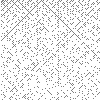

# Infsabot
Game involving Infinite State Automaton Robots

## Board Setup

The board is a square 2D board where every spot has one of two original states:

 - Empty
 - Material

In future versions, there may be multiple types of material.

If `x^2 + y^2` is prime, the square at `(x, y)` is material.

The initial board for the initial size `100 x 100` therefore looks like

where white is empty and black is material.

## Robots

Robots are placed initially at `(0, size)` and `(size, 0)`, of opposing teams. They are given some initial hit points and material.

Each team's goal is to destroy all the robots of the other team, only being able to control the initial program of the first robot.

## The Robot Program

The robot program is a Haskell program provided by a user which takes the current known state of the robot and outputs a robot action along with a representation of the new disk.

## The Robot State

A robot state consists of

 - A function `peekAtSpot` which takes a pair of offsets from the current position and outputs an optional image of a seen spot
 - An integer `material` containing the amount of material the robot currently has
 - A pair of coordinates `stateLocation` which represents the robot's current location on the board
 - An integer `stateAge` representing the current age of the robot in game ticks
 - A stringly-typed map from Strings to Strings `stateMemory` containing the current contents of the hard drive

## Robot Actions

A robot action is one of the following:

 - It can perform no operation (Noop)
 - It can move in a given direction.
 - It can dig
 - It can spawn a robot
    - In a given direction
    - With a given appearance
    - With some of the original robot's material
    - With a new memory
 - It can fire in a given direction
    - Devoting some material to the shell
 - It can send a message in a given direction

If any action is impossible (e.g., for lack of material), some subset of it that is possible will be performed. If two actions conflict (e.g., actions that would put two robots in the same position), neither is performed.

Fire and Message actions are immediate (i.e., they execute before moves) and do not conflict with anything.

If a robot's hit points drop to 0, it will be removed.

All actions cost a given quantity of material to perform, including No Operation. The only action that can produce material is digging in a spot containing material.

## Difficulty of the Game

The difficulty of the game stems from the fact that there is no way of sharing state between robots other than messages, which are only short-range.

Additionally, there is no way of telling whether a given robot is one of your robots or an enemy robot. This means that teams will have to figure out an identification scheme that cannot be trivially broken.

The fact that even no-ops cost material means that Infsabot is strictly bound in runtime. The fact that all robot programs must be pure functions means that Infsabot is deterministic.
