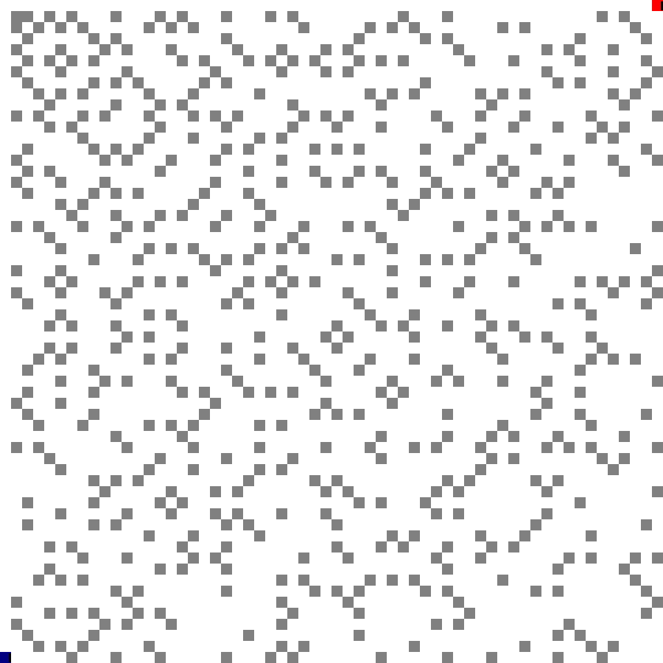

# Infsabot
Game involving Infinite State Automaton Robots

## Board Setup

The board is a square 2D board where every spot has one of two original states:

 - Empty
 - Material

In future versions, there may be multiple types of material.

If `x^2 + y` is prime, the square at `(x, y)` is material.

The initial board for the initial size `100 x 100` therefore looks like

Return 1
